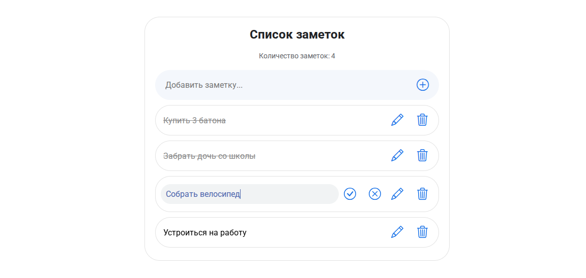

# React Todo APP

Простое приложение React JS для ведения заметок.

## Функционал

- Добавление заметок
- Удаление заметок
- Редактирование заметок (принять/отменить изменения)
- Отметить как выполненное

## Используется
- **React Js**
- **bootstrap-icons**
- **CSS module**
- **Vite**
- **Yarn**

## Внешний вид

  
   Интерфейс заметок

